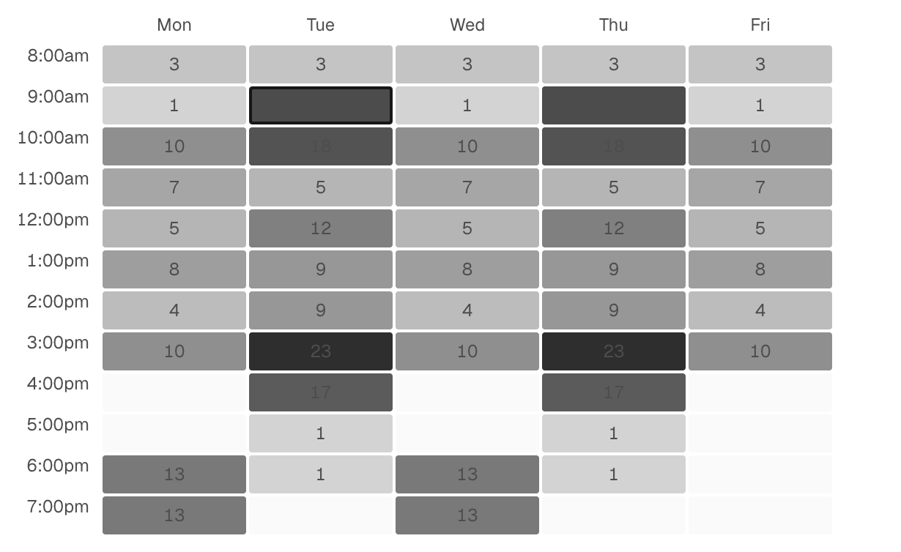
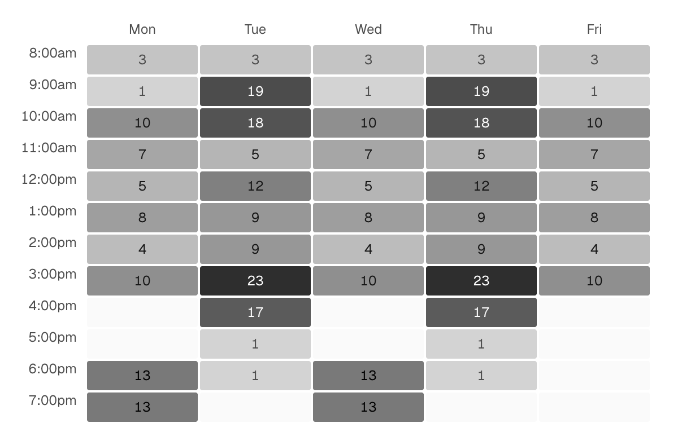

# GenUI Pipeline

This repo serves as a proof of concept for a "GenUI" interface, an interface that can change based on its specific user's needs and wants. This system uses two models: Jev, which is fast and cheap and can only select between options it is given, and a conventional model like Opus 5.5.

All the UI elements that appear on the screen are spec-driven. Each individual user's interface is described by a JSON document (the spec), and the frontend is a generic renderer that renders exactly what the spec describes. Every UI change is either picking from options the spec already lists, or an edit to the spec that has to pass validation first.

The demo app is a university course planner with three people to switch between:

- **Maya Chen**, a third-year CS student. She works library shifts on weekday mornings, plans on her phone, and avoids full sections.
- **Dr. Adaeze Okafor**, an advisor with 38 advisees. She works at a desktop and acts on the roster in bulk.
- **Sam Rivera**, a first-year student whose needs match the default app.

## Interesting Observations

- Despite the UI being spec-driven with the intent of making sure nothing ever looks "wrong", things can still look "wrong." For example, the spec never makes sure UI elements have enough contrast with each other to be legible, which seems to also be something LLMs continuoully struggle with. As always, the solution was to add verification, a little like the verification the pipeline does with UI specs. Whenever a component is installed, it is rendered in a headless Chrome with the app's real stylesheets, and a contrast audit is run. The component is rejected if any text is below 4.5:1 (3:1 for large text), overlaps other text, renders under 10px, or has a fill the stylesheet overrides.

<table>
  <tr>
    <td align="center"><b>Unverified</b></td>
    <td align="center"><b>Verified</b></td>
  </tr>
  <tr>
    <td></td>
    <td></td>
  </tr>
</table>


## How it works

Everyone starts on one shared default spec. Jev serves every request from whatever spec the person has. Claude only runs when Jev reports that the spec falls short: either the default does not fit the person at all, or a request asks for something no view can show.

### The spec

A spec is a list of views. Each view has a `purpose`, a `layout`, and a list of slots. Each slot places one library component in a region (`top`, `main`, or `aside`) and sets its props. The schema lives in `shared/spec.ts`.

Slot props come in two kinds:

- **Fixed props** in `props` encode stable preferences, such as a dense table for someone who works in bulk. They never change at runtime.
- **Adaptive props**, listed by key in `adaptive`, are the ones Jev chooses on every request, such as which time filter a course search applies.

Every component instantiates an entry from the Pattern Atlas, a catalog of 119 UI design patterns in `data/atlas.json`. A component's props are sub-dimensions of its atlas entry, and each option carries a plain-language description of when it is the right choice. Jev reads those descriptions as the options of its questions, so the wording of a spec is also Jev's prompt.

A spec passes two checks before it is saved. Zod checks its shape. `checkSpec` checks that the parts line up: every slot names a component in the library, every fixed value is one of that prop's options, no prop is both fixed and adaptive, each component supports the person's role, and `home` names a real view.

The shared default is `data/specs/default.json`. It has four views: `catalog`, `schedule`, `progress`, and `demand`. A personal spec is saved to `data/runtime/specs/<userId>.json` with every earlier version kept.

### Serving a request

`serve` in `server/jev.ts` answers each request with one TypeSafe `systemOne` call. The call carries the person's profile, their role, the device, the registration phase, the current view, and the request text. It asks a batch of questions:

- `view`: which view answers the request. The options are the views' `purpose` strings.
- `gap`: a yes-or-no question that returns a probability. Does the request need a filter, chart, data view, or action that no view offers?
- `gap_kind`: what kind of thing is missing, if anything.
- `layout`: `main-aside`, `stack`, or `columns`.
- One question per adaptive prop in every view. Jev answers them all in the same call, and the server keeps only the answers for the view Jev picked. That saves a second round trip.

Every answer is one of the options the spec lists, so Jev cannot produce a screen the renderer cannot draw. If the gap probability is 0.5 or higher, the server flags the request and shows the closest view while the person decides whether to have Claude build the missing part.

### Deciding whether to personalize

The **Personalize** button does not go straight to Claude. `gate` in `server/jev.ts` first asks Jev two questions about the person's stated needs and usage signals: would the default app serve every need as it is, and how specialized are those needs on a four-level scale. Claude builds a personal spec only if the chance that the default fits is below 0.5 or the specialization score is 1.5 or higher. Otherwise the person stays on the default, and **Personalize anyway** skips the gate.

This saves money. Most people should never trigger a Claude run, and the check that decides costs one Jev call.

### Claude agents

`server/claude/agents.ts` runs Claude through the Claude Agent SDK with every built-in tool turned off. Claude sees only in-process tools for reading the person's data, the component library, and the Pattern Atlas, plus tools that validate before they write. Each run is capped at 40 turns and $6, and each person can have one run at a time.

- **Personalize** designs a spec from the person's needs, usage signals, and data, then saves it with `submit_spec`.
- **Extend** handles a flagged request. If existing components can answer it in a new or changed view, Claude only patches the spec with `submit_spec_patch`. If not, Claude writes a new component with `write_component` first, then adds it to the spec.

When a write tool rejects its input, it returns the errors to Claude, which fixes them and calls the tool again.

### Validating generated components

`checkComponent` in `server/claude/check.ts` runs before a generated component is installed. It rejects the component if any of these fail:

- The module imports only `react`, `motion/react`, and `@kit`.
- The source does not mention `fetch`, `XMLHttpRequest`, `localStorage`, `document.cookie`, or `eval`.
- The module default-exports a function component.
- The source contains no raw colour values: no hex codes, no `rgb()`, `oklch()` or similar functions, and no named colours.
- The component renders on the server for every person whose role can use it, once with default props and once for every other option of every prop, without throwing and with visible text each time.
- The component passes the legibility audit in `server/claude/contrast.ts`.

The legibility audit bundles the component and renders it in headless Chrome with the same stylesheets as the app. It renders every prop option for every eligible person, in both the light and dark themes, at desktop width. It also renders the defaults at phone width and after clicking up to six of the component's controls. For each piece of text, it compares the text colour, with all opacity applied, against a screenshot of what is painted behind the text. It rejects the component if any text falls below WCAG AA contrast (4.5:1, or 3:1 for large text), overlaps other text, renders under 10px, or sets a `fill` attribute on SVG text that the stylesheet overrides. The errors name the text, both colours, the theme and the props, so Claude can fix them and try again.

Two things make the audit easy to pass. The kit's `heat(t)` returns a fill for a mark and an ink for text on that mark, and every pair is at least 4.5:1 in both themes. And `KIT.md` lists the only safe pairs of text and background colours. As a last resort, the renderer wraps each generated component in a guard (`watchContrast` in `web/src/runtime/contrast.ts`). The guard re-measures text whenever the component changes, scrolls, resizes or switches theme, recolours any label below AA, and logs a warning.

`bun run contrast` runs the audit against every installed component and the `heat()` ramp. It then checks that the audit rejects each fixture in `scripts/fixtures/illegible.tsx`, and that the guard repairs the fixtures with colour problems.

A component that passes moves from `data/runtime/staging/` to `data/runtime/components/` and is added to `data/runtime/library.json`. It joins the shared library, so later specs for other people can use it too. The browser imports generated components at runtime through Vite's `/@fs/` route (see `web/src/runtime/registry.tsx`), and each slot renders inside an error boundary. The contract generated components follow is in `web/src/kit/KIT.md`.

These checks are a lint, not a sandbox. `checkComponent` imports the generated module into the server process to render it, so run this only with models and keys you trust.

## Run it locally

You need:

- Nix with flakes enabled, which provides Bun and Node from `flake.nix`. You can also install Bun 1.4 yourself.
- A TypeSafe API key from [the TypeSafe console](https://console.typesafe.ai/keys).
- Claude credentials: either an `ANTHROPIC_API_KEY` or a logged-in Claude Code install.
- Google Chrome or Chromium for the legibility audit. On macOS the installed Google Chrome is found automatically. On Linux the Nix dev shell provides Chromium. Without a browser, Claude cannot install generated components.

1. Copy the example environment file and set `TYPESAFE_API_KEY` in it:

	```sh
	cp .env.example .env.local
	```

2. Enter the dev shell. With direnv, run `direnv allow`. It loads the flake and `.env.local`. Without direnv, run `nix develop`.

3. Install dependencies and start both servers:

	```sh
	bun install
	bun run dev
	```

	The API server logs `pipeline server on http://localhost:8787  jev=jev-latest claude=claude-opus-5-5`, and Vite serves the app on port 5173.

4. Open <http://localhost:5173>.

## Try the demo

The right-hand **Pipeline** panel shows what each model did. The **Activity** tab streams every Jev decision and every Claude tool call. The cost table at the top totals calls, median time, and spend per model.

1. With Maya selected, ask "Show my week". Jev picks the view, the layout, and the adaptive props from the default spec.
2. Click **Personalize**. Jev runs the gate, then Claude designs Maya's spec. Follow the run in **Activity**. When it finishes, the new spec loads and the changed slots are highlighted.
3. Ask "Show how prerequisites chain from what I've taken to the capstone". No view in a fresh setup can show that, so Jev flags it and shows the closest view. Click **Build it with Claude** to have Claude write a new component and add a view for it.
4. Switch **Device** to phone in the panel. Jev serves the same request again for a narrow screen.
5. Switch to Sam and click **Personalize**. Sam's needs match the default, so Jev is expected to keep the shared default and skip Claude.

Each person's suggestion chips include requests that no spec covers yet. For Dr. Okafor, try the heatmap of advisees' planned classes.

To start over for one person, click the reset button at the top of the panel, such as **Reset Maya**. It deletes that person's personal spec and clears their activity. `POST /api/reset` does the same for everyone and also deletes every generated component.

## Reference

### Environment variables

| Variable | Default | Purpose |
| --- | --- | --- |
| `TYPESAFE_API_KEY` | none, required | Authenticates Jev calls. |
| `ANTHROPIC_API_KEY` | Claude Code login | Authenticates Claude runs. |
| `JEV_MODEL` | `jev-latest` | Model for serving and the gate. |
| `CLAUDE_MODEL` | `claude-opus-5-5` | Model for both Claude agents. |
| `CLAUDE_PERSONALIZE_EFFORT` | `medium` | Reasoning effort for the personalize agent. |
| `CLAUDE_EXTEND_EFFORT` | `high` | Reasoning effort for the extend agent. |
| `PORT` | `8787` | API server port. The Vite proxy in `vite.config.ts` expects 8787. |
| `DEBUG_AGENT` | unset | Logs the agent's MCP server status and tool list at startup. |
| `CHROME_PATH` | detected | Browser executable for the legibility audit. |

The Jev cost in the panel is an estimate at $0.042 per million input tokens, set in `server/jev.ts`.

### Scripts

| Command | What it does |
| --- | --- |
| `bun run dev` | Starts the API server and Vite together. |
| `bun run server` | Starts only the API server. |
| `bun run web` | Starts only Vite. |
| `bun run build` | Builds the frontend. |
| `bun run typecheck` | Runs `tsc --noEmit`. |
| `bun run atlas` | Regenerates `data/atlas.json` from `Pattern Atlas.html`. |
| `bun run contrast [id ...]` | Runs the legibility audit on installed components. Without ids, it also self-tests the audit and the runtime guard. |

The scripts in `scripts/` call the real models from the command line, bill your keys, and do not need the web app:

- `bun run scripts/try-jev.ts` runs the gate for every person, then serves a few requests.
- `bun run scripts/try-gaps.ts` checks which requests Jev flags as gaps against expected answers.
- `bun run scripts/try-personalize.ts [personId]` runs the personalize agent without the gate. It saves a new spec.
- `bun run scripts/try-extend.ts [personId] [request] [gapKind]` runs the extend agent. It can install a component and save a new spec.

### HTTP API

The server in `server/index.ts` exposes these routes. `:id` is `maya`, `okafor`, or `sam`.

| Route | Purpose |
| --- | --- |
| `GET /api/bootstrap` | People, the default spec, and model config. |
| `GET /api/library` | Every builtin and generated component definition. |
| `GET /api/users/:id/spec` | The person's current spec, the library, the version history, and any active Claude run. |
| `GET /api/users/:id/spec/:version` | One earlier spec version. |
| `POST /api/users/:id/serve` | Serves a request. Body: `request`, `context`, and optional `currentView` and `forceView`. |
| `POST /api/users/:id/personalize` | Runs the gate and, if it passes or `force` is true, starts the personalize agent. |
| `POST /api/users/:id/extend` | Starts the extend agent. Body: `request` and `gapKind`. |
| `POST /api/users/:id/reset` | Deletes the person's personal spec. |
| `POST /api/reset` | Deletes all personal specs and generated components. |
| `GET /api/events` | Server-sent event stream of every pipeline event. |

Reset routes return 409 while a Claude run is in progress. Events are kept in memory, capped at 2,000, and lost when the server restarts. Specs and generated components persist on disk in `data/runtime/`, which git ignores.

### Repo layout

```
data/
	atlas.json            Pattern Atlas entries Claude picks patterns from
	specs/default.json    shared default spec
	runtime/              personal specs, generated components, library.json (git-ignored)
server/
	index.ts              HTTP routes
	jev.ts                gate and serve
	claude/agents.ts      personalize and extend agents and their tools
	claude/check.ts       generated-component validation
	claude/contrast.ts    legibility audit in headless Chrome
	store.ts              spec and library storage
shared/
	spec.ts               spec schema and checkSpec
	library.ts            builtin component definitions
	personas.ts           the three demo people
	data.ts               course, section, and student data
web/src/
	components/           builtin components
	kit/                  data hooks and helpers for components, and KIT.md
	runtime/              Renderer, the component registry, and contrast measurement
	pipeline/             the Pipeline panel
scripts/                dev runner, atlas extraction, contrast audit, and manual model checks
```
